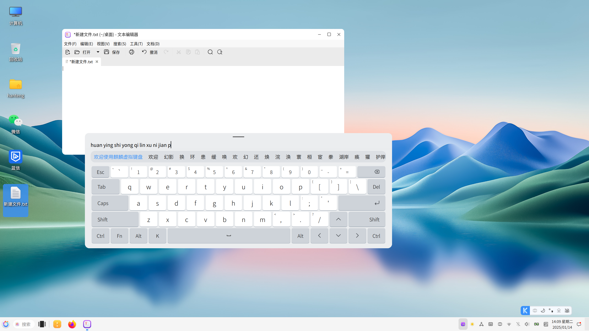

# Kylin Virtual Keyboard

## Introduction
In order to solve the problem of the lack of easy-to-use virtual keyboard input methods on Linux systems, the openKylin community InputMethod SIG and the Fcitx community work closely together.   
At the end of 2022, Fcitx5 support for virtual keyboards was realized for the first time, which solved the problem that the Fcitx5 input method framework could not support virtual keyboard input, making it possible to develop virtual keyboard input methods based on Fcitx5!

## Build and compile
1. Download the dependency package
```
sudo apt install cmake libkf5windowsystem-dev qtdeclarative5-dev libfcitx5-qt-dev qtbase5-dev
qml-module-qtquick-controls2 libgsettings-qt-dev pkg-config qtquickcontrols2-5-dev libfcitx5core-dev
````
2. Build the project
``` 
mkdir build && cd build
cmake .. -DCMAKE_INSTALL_PREFIX=/usr -DCMAKE_INSTALL_LIBDIR=lib/x86_64-linux-gnu
make 
sudo make install
``` 
The first install needs to be executed in order to update the scheme: sudo glib-compile-schemas /usr/share/glib-2.0/schemas/  

## How to use
1. Click the tray icon to wake up the Kylin virtual keyboard
2. Click the hover button to wake up the Kylin virtual keyboard


## Thanks
Thanks to Fcitx author Wengxt for his guidance on the development of Kylin Virtual Keyboard!  
Thank you to all the developers who participated in the Kylin Virtual Keyboard project!